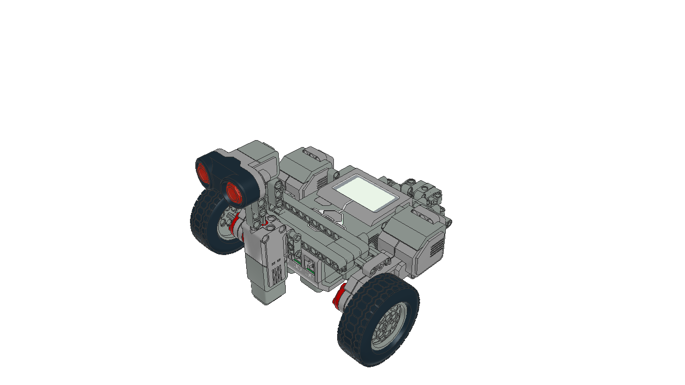
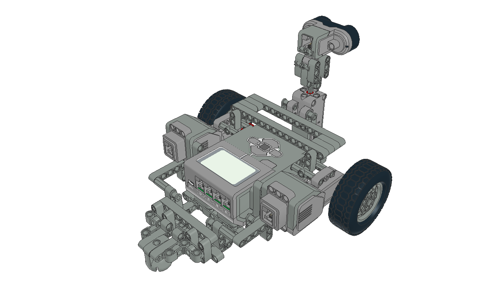

# EV3Rover
EV3Rover is a data acquisition module for an any-time and any-space, sparse-sensing SLAM system operating on low-cost robotics platforms. It facilitates environment exploration and constructs scans of the environment using an ultrasonic sensor.

### What hardware do I need to use EV3Rover?
You need a LEGO Mindstorms EV3 robotics kit. Using the components found in this kit you'll need to consturct a non-holonomic, differential-drive vehicle. To aid with hardware assembly, the below LeoCAD images are provided:
 

### What about software?
After constructing the hardware vehicle you'll need to install the EV3DEV Operating System onto your EV3 brick. Instructions on how to do this can be found on the [EV3DEV webiste](https://www.ev3dev.org/).

Once you have installed the EV3DEV OS you will need to clone and build the [EV3DEV-LANG-CPP](https://github.com/ddemidov/ev3dev-lang-cpp.git) library.
```bash
git clone https://github.com/ddemidov/ev3dev-lang-cpp.git
cd ev3dev-lang-cpp
mkdir build
cd build
cmake .. -DEV3DEV_PLATFORM=EV3
make -j4
make install
cd ../..
```
After you have installed the above library, clone and build this repository:
```bash
git clone https://github.com/sg2295/EV3Rover.git
cd ev3rover
mkdir build
cd build
cmake .. -DCMAKE_BUILD_TYPE=MinSizeRel
make -j4
./ev3rover  # Run the executable (if you're on the EV3 device)
```
It is recommended to do the above in a Docker image of the EV3DEV OS, instead of the EV3 hardware, to speed up compilation. After building this repository, copy the executable over to the EV3 brick via `scp` and you're ready to go!

N.B. the design of EV3Rover is inherently modular and allows for the trivial swapping of both the motion and observation modules. If you choose to use a different vehicle or sensor configuration, you'll need to update the respective module(s) accordingly.

### Why did you make it?
I created EV3Rover as part of my BSc Computer Science dissertation at the University of Bath. EV3Rover formed the basis of my research into the development of an any-time and any-space, sparse-sensing SLAM platform. It was used for environment exploration and data acquisition.
